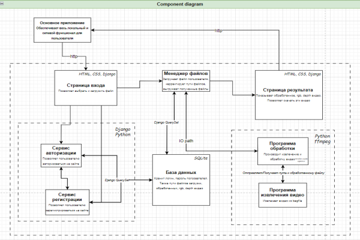
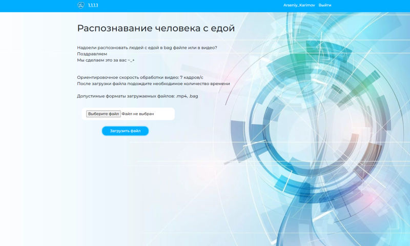

# Поиск людей на видео

Наш проект представляет собой сайт, внутри которого работает программа, использующая инструментарий [OpenCV](https://github.com/opencv/opencv) и [NVIDIA-Cuda](https://developer.nvidia.com/cuda-toolkit) и обрабатывающая `.bag` или `.mp4` файлы. Программа выдаёт 3 видео-файла `RGB, DEPTH и RGB с обнаруженными объектами`, которые выводятся на странице сайта в плеере с возможностью скачивания. 

# Содержание  
1. [Архитектура](#arch)
2. [Использование](#usage)
3. [Как запустить Docker Container](#run)
4. [Запуск контейнера с программой репозитория](#exec)
5. [Запуск во вне Docker](#OutDocker)

<a name="arch"><h2>Архитектура</h2></a>
Для понимания того, как устроен наш проект, здесь приведена следующая диаграмма


<br>

<a name="usage"><h2>Использование</h2></a>
_Привиденная ниже инструкция подходит только для видеокарт ниже серии Ampere_
_Для использования на видеокартах 30-ой и 40-ой серии необходимо перейти в пункт использования [запуск вне Docker](#outDocker)_
<br>Сайт запускается внутри _Docker-Container_. Скачать _Docker_ можно отсюда:
- [https://www.docker.com/get-started/](https://www.docker.com/get-started/)

<br>Скачайте Docker Image: 
- [https://hub.docker.com/u/karseny99/](https://hub.docker.com/u/karseny99/)
   ```sh
   $ docker pull karseny99/site:latest
   ```

<a name="run"><h2>Как запустить Docker Container</h2></a>
- С поддержкой GPU _(значительно ускоряет работу программы, обрабатывающей видео)_:
  
    Вам понадобится установить [NVIDIA Container Toolkit](https://docs.nvidia.com/datacenter/cloud-native/container-toolkit/install-guide.html) на ваше устройство. Запустите контейнер этой командой:

    ```
    $ docker run --gpus all -it --rm -p 8000:8000 -v "$(pwd):/workspace" karseny99/site:latest
    root@22067ad0cc87:/myapp#  
    ```

- Без поддержки GPU:
    
    Если использованине видеокарты на вашей машине не представляется возможным, вы можете запустить контейнер без поддержки GPU
    ```
    $ docker run -it --rm -p 8000:8000 -v "$(pwd):/workspace" karseny99/site:latest
    root@cc00562d816e:/myapp# 
    ```
<a name="exec"><h2>Запуск контейнера с программой репозитория</h2></a>
1. Установите данный репозиторий `git clone https://gitlab.mai.ru/ArAKarimov/computer_vision.git`. Веса обученной модели уже включены, но если вы хотите поменять их на другие, то скачайте их отсюда [YOLO](https://pjreddie.com/darknet/yolo/) вместе с соответствующим конфигурационным файлов `yolov3.cfg`. Затем переместите эти файлы: <br> `mv yolov3.cfg yolov3.weights ~/computer_vision/site_server/comp_vision/yolo`
 

2. Перейдите в директорию с репозиторием и установите папку, как том Docker:
    ```
    $ docker run --gpus all -it --rm -p 8000:8000 -v "$(pwd):/workspace" karseny99/site:latest
    root@771c5bcb2895:/myapp# cd ../workspace
    root@771c5bcb2895:/workspace# ls
    Dockerfile    db.sqlite3          files/      requirements.txt  static/
    comp_vision/  docker-compose.yml  manage.py*  site_server/      users/
    ```
3. Запустите веб-сайт по указанному адресу:
    
    ```
    root@771c5bcb2895:/workspace# python3 manage.py runserver 0.0.0.0:8000
    ```
4. Откройте веб-сайт по аресу **127.0.0.1:8000** <br>


<a name="outDocker"><h2>Запуск во вне Docker</h2></a>
Если вы хотите запустить сайт не в Docker-контейнере, вам необходимо скачать актуальные репозитории [OpenCV](https://github.com/opencv/opencv) и [OpenCV-contrib](https://github.com/opencv/opencv_contrib). Собрать OpenCV вместе с [NVIDIA-cuda](https://developer.nvidia.com/cuda-toolkit) (**Для работы программы с GPU!**). Также вам понадобиться скачать [ffmpeg](https://ffmpeg.org/) и недостающие фреймворки проекта из `requirements.txt`. 
Также при запуске сайта `python3 manage.py runserver` не обязательно указывать определенные адреса: можно подключаться по тому, что вернет программа.
